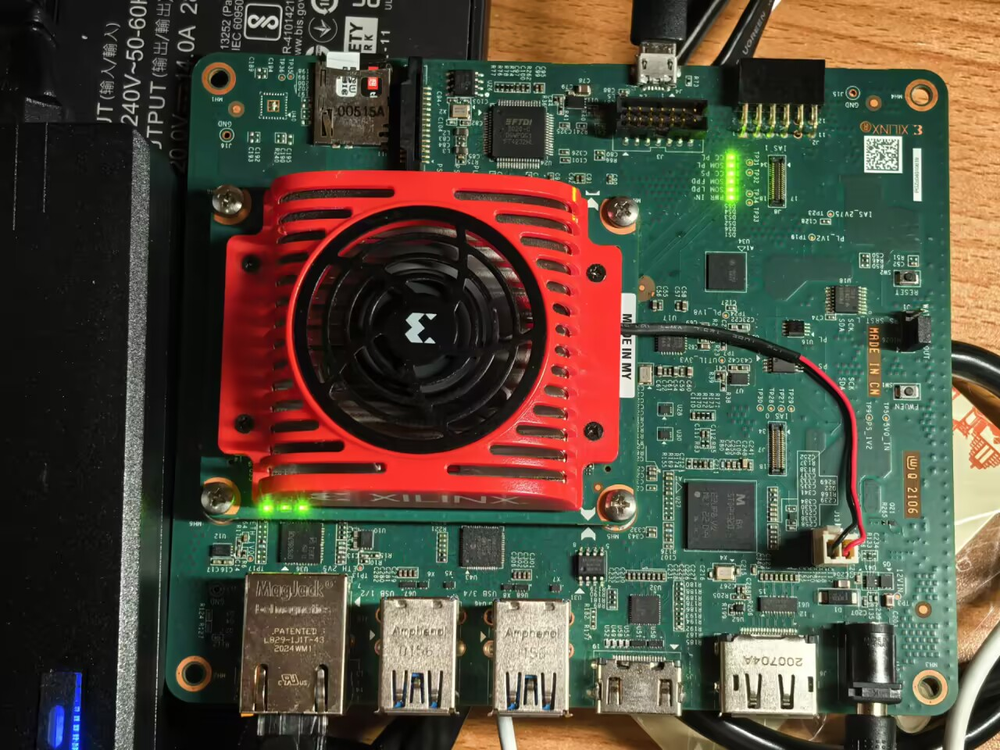
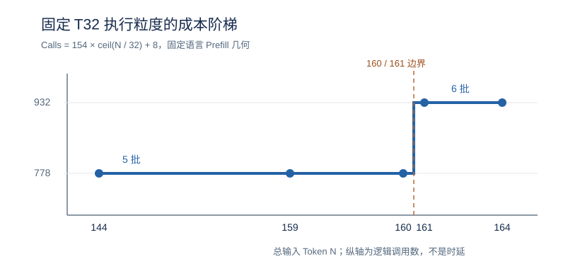

# Mage-VL 4B on KV260

[English](README.en.md) · 简体中文

这是一个在 AMD Kria KV260 上运行 Mage-VL 4B 的多模态推理研究原型。我们解决的主要问题是：如何在有限内存和固定 T32 FPGA 执行粒度下，完成可核验的 PS–PL 推理，并让输入预算真正对应硬件开销。

项目已完成混合精度权重适配、PS 视觉塔与 PL 语言 Linear 协同、固定视频样例的独立安装验证，以及 Web 手动语义复核。它也记录了没有奏效的优化：局部解析提速未降低完整请求时间，T64 未满足时序，通用快速检测器在现有厨房视频中难以识别菜刀。这些结果共同界定了当前实现的能力。

默认板端实现采用稳定的 T32 Build `0x4D395832`。源码和实验数据可审阅；模型权重与 bitstream 不在 Git 仓库中，预构建包尚无公开下载地址。

## 硬件成本为何不是线性的



上图为本项目使用的 KV260 实物照片，由项目所有者提供并同意公开。网页截图和原始监控视频不随仓库发布。



成本图显示固定语言 Prefill 几何的**逻辑调用数**，不是整请求时延。[系统架构](docs/architecture.md)说明 PS–PL 分工，[实验索引](experiments/README.md)保留原始测量。

## 主要工作

1. **让 4B 模型适配板端资源。** 按模块敏感性选用 W2/W3/W4 与高精度保留，冻结打包权重、布局和校验值；避免统一低位宽破坏语义。[部署探索](docs/optimization_journey.md)
2. **打通可验证的 PS–PL 推理。** PS 负责视觉、Attention、Norm 和 KV；PL 的 T32 核执行语言 Linear/LM Head。固定输入验证同时检查 Build ID、FPGA 调用、输出和 CPU Linear fallback。[架构](docs/architecture.md) · [源码导览](docs/source_map.md)
3. **以真实请求决定优化取舍。** 视觉 W4 向量化解码、权重暂存和输出解析取得组件收益；T64、Decode-one 与解析器候选则依据时序或端到端测量保留为实验。[性能分析](docs/performance_attribution_history.md)
4. **研究输入预算与批边界。** BACT-V2 将视图和 Prompt 预算对齐 T32 批次；164→159 Token 跨过 160 边界，语言逻辑调用从 932 降至 778。[BACT 方法与 Prompt 实验](docs/bact_v2.md)

## 代表性结果

| 实验 | 结果与测量范围 |
| --- | --- |
| 独立安装的固定视频 | 四帧按顺序提交，但模型实际只用末帧的两个视图；159 输入 Token、778 次语言 FPGA 逻辑调用、输出 `0`；首 Token **230.721 s**，不含初始化。[公开摘要](experiments/fixed_video/RESULT.json) |
| 同板 CPU／PL 单链 | 两种固定双 descriptor 形状各 10 对交错；W2 为 **5.891/2.244 ms**，W4 为 **5.871/2.525 ms**（A53 CPU/PL），约 **2.63×/2.33×**。这不是整模型加速比。[测试条件](docs/cpu_pl_benchmark.md) |
| T32 批边界 | 在固定 Prefill 合同下，164 Token 为 6 批/932 次调用，159 Token 为 5 批/778 次调用；27 条板端记录支持成本阶梯。[方法与证据](docs/bact_v2.md) |
| Web 手动复核 | 隔离版本完成两次真实视频窗口的 Web→4B/FPGA→SSE 回传，首 Token **196.286/174.653 s**；不是自动报警触发。[实验记录](experiments/m335_manual_web_review/REPORT.md) |

分钟级的 4B 首 Token 还不能满足秒级视频语义更新。现有受限路径仅使用末帧两视图；快通道可以持续接收并丢弃过期帧，但自动刀具触发尚未得到可靠性验证。具体条件和其他结果见[结果总表](docs/results.md)与[适用边界](docs/limitations.md)。

## 开始使用

没有开发板时，可先按[环境说明](docs/environment.md)配置 Python，然后复算已冻结的 BACT 选择、成本和质量记录；命令不下载权重，也不进行新推理：

```bash
python3 scripts/m321_reproduce_bact_v2_evidence.py --only all
```

在 KV260 上运行前，先读[安装步骤](docs/quickstart.md)、[预构建资产及校验](docs/prebuilt_release.md)、[模型与硬件资产](docs/model_setup.md)和[固定视频复现](docs/fixed_video_reproduction.md)。无设备预检入口为：

```bash
python3 scripts/preflight.py --dry-run --config configs/deployment.example.json
```

本地 v7 预构建包及固定视频伴随包已在维护者的 KV260 上通过独立目录安装，但尚未提供公开下载；**仅克隆此仓库不足以完成同一板端安装**。源码构建覆盖范围见[构建说明](docs/build.md)。

## 阅读路线

| 想了解什么 | 从这里开始 |
| --- | --- |
| 系统如何分工 | [架构](docs/architecture.md) · [源码导览](docs/source_map.md) |
| 为什么选当前实现 | [部署与优化探索](docs/optimization_journey.md) · [BACT/Prompt](docs/bact_v2.md) |
| 如何复核数字 | [结果总表](docs/results.md) · [实验索引](experiments/README.md) |
| 如何部署或构建 | [快速开始](docs/quickstart.md) · [资产清单](manifests/external_assets.json) · [构建说明](docs/build.md) |
| 来源、许可与版本 | [原创代码许可范围](LICENSE_SCOPE.md) · [代码来源](docs/provenance.md) · [第三方说明](THIRD_PARTY_NOTICES.md) · [发布状态](RELEASE_READINESS.md) |

本仓库是研究预览，不是经过认证的安全监控产品。项目所有者已为有权授权的原创代码选择 Apache-2.0；第三方文件、模型与样例仍保留各自的许可及再分发条件。见[许可范围](LICENSE_SCOPE.md)与[发布状态](RELEASE_READINESS.md)。
