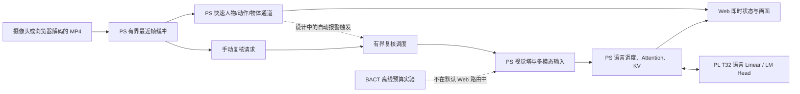

# 系统架构：持续输入与按需语义复核

KV260 的 Cortex-A53（PS）负责视频采集/预处理、Mage-VL 视觉塔、Attention、Norm、RoPE、Softmax 和 KV cache；FPGA（PL）的稳定 T32 核执行语言 Linear 与 LM Head。模型、overlay 和缓冲区在一次会话中复用。网页经 HTTP 送帧，经 SSE 显示状态和结果。

实线手动复核由隔离 M335 版本在 KV260 上完成两次真实 Web→4B/FPGA→SSE 请求；自动报警到 4B 的虚线是系统设计，尚未得到同等验证。快速通道可以持续接收并丢弃过期帧，但慢通道首 Token 为分钟级，不能据此称 4B 实时视频理解。

固定视频研究入口与 Web 入口也不同。M328 从四帧输入中实际选择最后一帧，生成两个视觉视图和 98 个视觉 Token，再形成 159-Token Prompt；它验证的是该受限路径的直接 4B 推理，不是四帧时序理解。具体输入身份与计时见[固定视频结果](../experiments/fixed_video/RESULT.json)。

默认运行时为 Build `0x4D395832`、kernel `mage_m120_m89x2_0`。冻结 Prefill 合同的调用数为 `154×ceil(N/32)+8`，只描述语言逻辑调用，不能替代全请求时延。仓库中多个历史同名模块依靠确定的导入顺序工作；[源码导览](source_map.md)列出稳定入口和活动依赖，[安装步骤](quickstart.md)封装这些路径。当前文档整理不移动运行目录。
