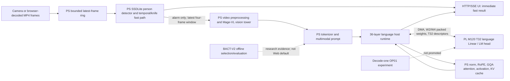

# Architecture and execution identities

The original M254 import begins in `m254_video_server.py`, which patches the M223 `video_server` controller after M243 imports the accepted M238/M241 runtime. The copied paths are deliberately not flattened: Python has multiple `video_server.py`, `m230_prefill_runtime.py`, and related files. `scripts/preflight.py` constructs a release-rooted import precedence. The owner-board v7 independent install verified the release-root module paths at no-frame Web runtime-ready, and the separate M328 direct-video gate exercised the frozen release M277 runtime subset. This does not establish generic clean-OS provisioning or alarm-triggered Web 4B video.

The stable PL bitstream uses Build `0x4D395832`, kernel `mage_m120_m89x2_0`. The PS reads W4 vision data, constructs visual features, handles attention/normalization/KV, and sends quantized language Linear descriptions and weight windows to PL through PYNQ/XRT and DMA. BACT's `154*ceil(N/32)+8` call identity applies only to its measured fixed Prefill contract, not arbitrary Decode or whole Web latency. The M277 fixed-video BACT fixture samples four source frames but passes only two last-frame views to the vision tower; it does not prove four-frame temporal understanding.
